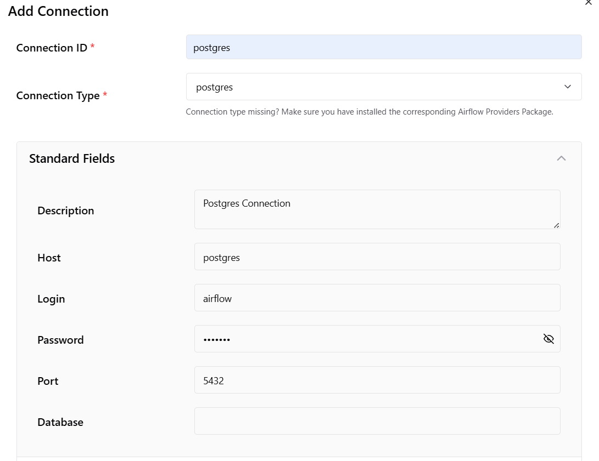

# Project - Step by Step 
## Setup

### Initial Steps

- Download `docker-compose.yml`.
    (This is from Udemy, might have to explain what's actually in it and how it's different from the default (local executor))

- Put it in `Airflow ETL Projcet` --> `flights_above_me`.

- New terminal: Inside `flights_above_me` folder run 
    ```bash
    uv venv --python 3.13.5
    ```

- Activate `.venv`:
    ```cmd
    .venv\Scripts\activate
    ```
    inside cmd.

- Install packages
    ```cmd
    uv pip install apache-airflow
    ```
    -> gonna have to create a  `requirements.txt` that does this.

- Start services using docker compose:
    ```cmd
    docker-compose up -d
    ```

### Initialise Airflow
- The airflow-init container initialises the database on first run.

- Checked if the admin user existed:
```bash
docker-compose run --rm airflow-apiserver airflow users list
```
(replace airflow-server with the service name from `docker-compose ps`)
- Created a new admin user if necessary:

```bash
docker-compose run -rm airflow-apiserver db init
```


```bash
docker-compose run --rm airflow-apiserver airflow users create `
--username airflow `
--firstname Admin `
--lastname User `
--role Admin `
--email admin@example.com `
--password airflow
```
- Run the create commands that gets automatically paster into the cmd

- Set password to `airflow`


##### What I did
- User `airflow` already existed, changed the password with: 
```cmd
docker-compose run --rm airflow-apiserver airflow users reset-password -u airflow -p airflow
```
to be able to access it.
 

### Connect in Airflow UI

- Add this install to `requirements.txt`:
    ```cmd
    uv pip install apache-airflow-providers-postgres
    ```

- Go to `Admin` -> `Connections` on the Airflow UI.
- Configure the PostgreSQL connection:




## Ready to begin